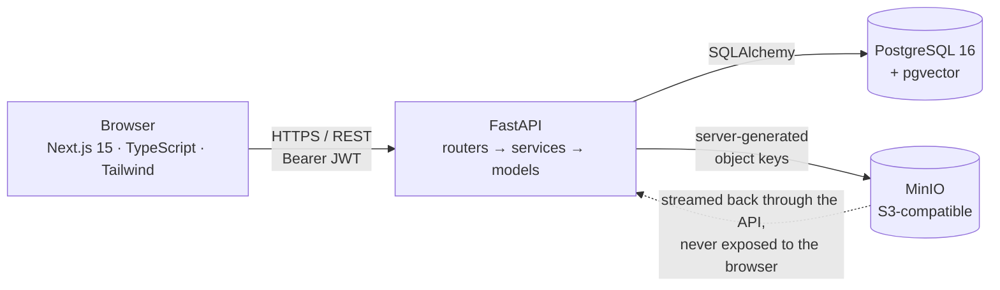
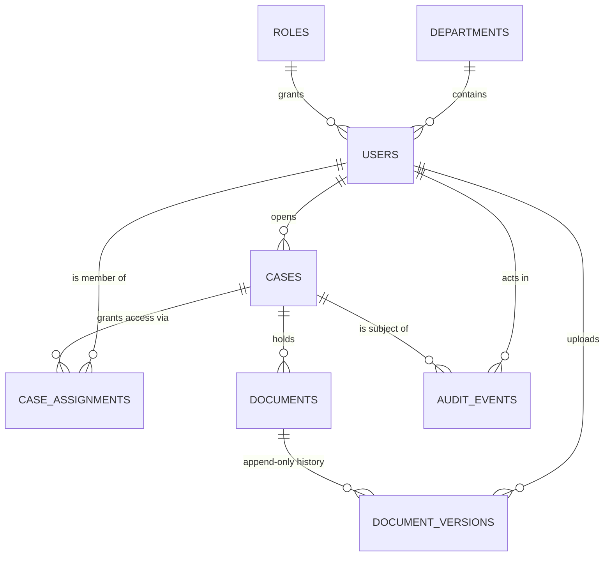

# NyayaVault

**Secure Digital Document Management System for Legal and Investigation Documents**
Smart India Hackathon · Problem Statement **26190** · **Milestone 0 — Foundation**

A case-centric vault where every document carries a verifiable cryptographic
fingerprint and every action leaves a record that cannot be quietly rewritten.

> This is a working prototype, not a production system. Section
> [Known limitations](#known-limitations) is deliberately blunt about what is
> missing, and [SECURITY.md](SECURITY.md) documents the threat model.

---

## What M0 delivers

| # | Capability | Status |
|---|---|---|
| 1 | Project structure, Docker Compose, PostgreSQL + MinIO wiring | ✅ |
| 2 | Alembic migrations, pgvector extension enabled | ✅ |
| 3 | User, Role, Department, Case, Document, DocumentVersion, AuditEvent models | ✅ |
| 4 | JWT authentication, bcrypt password hashing | ✅ |
| 5 | Role-based **and** case-level authorisation | ✅ |
| 6 | Case creation, listing (searchable, filtered), detail | ✅ |
| 7 | Validated document upload to MinIO with server-generated keys | ✅ |
| 8 | SHA-256 computed at ingest for every version | ✅ |
| 9 | Append-only document versioning | ✅ |
| 10 | On-demand integrity verification against stored bytes | ✅ |
| 11 | Hash-linked audit trail + chain verification endpoint | ✅ |
| 12 | Next.js dashboard, login, cases, case detail, document detail | ✅ |
| 13 | 56 automated backend tests | ✅ |

**Explicitly out of scope for M0** (per the brief): OCR, semantic/vector search,
AI metadata extraction and summarisation, digital signatures, evidence workflow
and chain-of-custody transfer, court/evidence package generation, blockchain
anchoring.

---

## Architecture

A **modular monolith** — one deployable API process with clear internal seams.
No microservices.



Request path inside the API:

```
HTTP  →  router          thin: validates shape, resolves dependencies
      →  dependency      authenticates the JWT, re-reads the user from the DB
      →  authorization   role capability + case-level access
      →  service         domain rules, one transaction, audit write
      →  model / storage SQLAlchemy + object storage
```

### Data model



---

## Quick start

**Prerequisites:** Docker and Docker Compose. Nothing else.

```bash
git clone <your-repo-url> nyayavault
cd nyayavault

# 1. Create your environment file
cp .env.example .env

# 2. Replace EVERY value marked CHANGE_ME in .env.
#    Generate strong secrets with:
python -c "import secrets; print(secrets.token_urlsafe(64))"

# 3. Set a bootstrap admin password (there is no default anywhere)
#    Edit .env:  SEED_ADMIN_PASSWORD=YourStrong#Passw0rd
#    Policy: at least 12 characters, 3 of {lowercase, uppercase, digit, symbol}

# 4. Start everything. Migrations and seeding run automatically.
docker compose up -d --build

# 5. Watch it come up
docker compose logs -f backend
```

| Service | URL |
|---|---|
| Web application | http://localhost:3000 |
| API docs (Swagger) | http://localhost:8000/docs |
| API health | http://localhost:8000/health |
| MinIO console | http://localhost:9001 |

Sign in at http://localhost:3000/login with the username and password you set in
`SEED_ADMIN_PASSWORD`.

A `Makefile` wraps the common commands — run `make` to see them.

### Running without Docker

<details>
<summary>Backend on the host</summary>

```bash
cd backend
python -m venv .venv && source .venv/bin/activate
pip install -r requirements.txt

export $(grep -v '^#' ../.env | xargs)   # or set the variables yourself
alembic upgrade head
python -m app.seed
uvicorn app.main:app --reload
```
</details>

<details>
<summary>Frontend on the host</summary>

```bash
cd frontend
cp .env.local.example .env.local
npm install
npm run dev
```
</details>

---

## Demo walkthrough

A five-minute path that shows every M0 guarantee:

1. **Sign in** as the seeded admin. The sign-in is already in the audit trail.
2. **Create two more users** (`POST /api/v1/users` via Swagger, or add a users
   page later) — one `INVESTIGATOR`, one `AUDITOR`.
3. **Open a case** from the Cases page. The server allocates `NV-2026-000001`;
   the client cannot choose it.
4. **Upload a PDF.** The document detail page shows its full SHA-256.
5. **Press "Verify integrity".** The API re-reads the bytes out of MinIO,
   re-hashes them and confirms the match.
6. **Tamper with it.** In the MinIO console at :9001, overwrite that object with
   a different file. Press "Verify integrity" again — it now reports a
   **MISMATCH**, with both hashes shown.
7. **Supersede the document** with a corrected file and a stated reason. v1 is
   still there, still downloadable, still with its original hash.
8. **Sign in as the second investigator** and try to open the case by URL — it
   returns *not found*, because the API does not confirm that cases you cannot
   see even exist.
9. **Sign in as the auditor** → Audit trail → **Verify chain**. It reports
   *Intact*. Now edit one historical `audit_events` row directly in psql and
   verify again: the chain reports exactly which event broke.

Step 9 is the one worth rehearsing. It is the difference between an audit *log*
and an audit *trail*.

---

## Security posture

Design decisions, and the reasoning behind each:

| Concern | How it is handled |
|---|---|
| **Secrets** | Every credential comes from the environment. `config.py` refuses to start in production with a placeholder or short JWT secret and warns loudly in development. Nothing is committed. |
| **Passwords** | bcrypt (cost 12) over a SHA-256 pre-hash, so bcrypt's 72-byte truncation cannot make two long passwords equivalent. Policy: ≥12 chars, 3 of 4 character classes. |
| **Role escalation** | The JWT carries a `role` claim for debugging only. Authorisation **always** re-reads the user and role from the database. A test proves a validly-signed token with `role: ADMIN` still gets a 403. |
| **Case-level access** | ADMIN sees all; AUDITOR reads all; others see only cases they created or were assigned. A case you cannot see returns **404, not 403** — so the API cannot be used to probe for cases. |
| **Storage paths** | Object keys are built by the server from UUIDs it generated: `cases/<uuid>/documents/<uuid>/v<n>/<uuid>-<safe-name>`. Client filenames are reduced to a basename and stripped to `[A-Za-z0-9._-]`. |
| **File validation** | Extension allow-list **and** magic-byte sniffing **and** size limit. A shell script renamed `.pdf` is rejected; a ZIP renamed `.docx` is opened and checked for `word/document.xml`. |
| **Upload size** | Enforced *while streaming* in 1 MiB chunks, so an oversized upload is abandoned partway rather than buffered first. |
| **Overwrites** | `UNIQUE(document_id, version_number)` and `UNIQUE(object_key)` make append-only a database guarantee, not a convention. Re-uploading identical bytes returns 409 instead of creating a duplicate. |
| **MinIO exposure** | Never reachable from the browser. Downloads stream through the API so authorisation is re-checked and every read is audited. |
| **SQL injection** | Everything goes through SQLAlchemy with bound parameters. Search wildcards (`%`, `_`) in user input are escaped so a search for `%` cannot widen the result set. |
| **`eval` / `exec`** | Not present anywhere in the codebase. |
| **Error responses** | Terse and uniform. Driver and schema details are logged with a request id, never returned. |
| **Audit integrity** | Global hash chain. Verification walks the hash pointers — not a sortable timestamp column — and detects edits, deletions and forks. |

Read [SECURITY.md](SECURITY.md) for the threat model and the production
hardening checklist.

---

## API

Base path: `/api/v1`. Full interactive documentation at `/docs` while
`APP_ENV != production`.

| Method | Path | Notes |
|---|---|---|
| `POST` | `/auth/login` | Returns a bearer token. Every attempt is audited. |
| `GET` | `/auth/me` | Current user, resolved from the database. |
| `GET` `POST` | `/users` | ADMIN only. |
| `GET` | `/roles`, `/departments` | Reference data. |
| `POST` | `/cases` | ADMIN, INVESTIGATOR, LEGAL_OFFICER. |
| `GET` | `/cases` | Scoped, searchable, status-filtered, paginated. |
| `GET` | `/cases/{id}` | 404 if not visible to you. |
| `PATCH` | `/cases/{id}/status` | Requires MANAGE access. |
| `GET` `POST` | `/cases/{id}/members` | Case-level access grants. |
| `GET` | `/cases/{id}/audit` | Audit trail for one case. |
| `GET` | `/cases/statistics` | Dashboard counters over visible cases. |
| `POST` | `/cases/{id}/documents` | Upload → creates version 1. |
| `GET` | `/cases/{id}/documents` | List with current-version metadata. |
| `GET` | `/documents/{id}` | Metadata + full version history. |
| `POST` | `/documents/{id}/versions` | Append v2, v3… `change_reason` required. |
| `GET` | `/documents/{id}/versions` | History, oldest first. |
| `GET` | `/documents/{id}/download` | Streamed through the API; audited. |
| `GET` | `/documents/{id}/verify` | **Re-hashes stored bytes** and compares. |
| `GET` | `/audit/events` | System-wide log. ADMIN, AUDITOR. |
| `GET` | `/audit/verify` | **Chain integrity report.** ADMIN, AUDITOR. |

### Document upload sequence

```
1  validate the request shape          FastAPI + Pydantic
2  authenticate                        JWT → user re-read from the database
3  authorise for the case              role capability + case access + case is open
4  validate the file                   extension · magic bytes · streamed size cap
5  compute SHA-256                     from the received bytes, before storage
6  store the object                    server-generated key, refuses to overwrite
7  create/reuse the Document row
8  create DocumentVersion v(n)         UNIQUE(document_id, version_number)
9  persist the SHA-256
10 append an AuditEvent                same transaction as 7–9
```

If step 8, 9 or 10 fails, the transaction rolls back **and** the object just
written is removed, so storage never runs ahead of the database.

---

## Testing

```bash
make test          # inside the container
make test-local    # on the host, from backend/

cd backend && python -m pytest -q          # 56 tests, ~6 seconds
cd backend && python -m pytest -q -k audit # one area
```

The suite runs on SQLite with an in-memory object-storage backend, so it needs
neither PostgreSQL nor MinIO running. Coverage of the ten scenarios the brief
requires, plus the security properties worth proving:

| Required scenario | Tests |
|---|---|
| 1. User authentication | `test_login_succeeds_and_returns_a_usable_token` |
| 2. Invalid login | `test_login_with_wrong_password_is_rejected`, `test_login_for_unknown_user_gives_the_same_message` |
| 3. Case creation | `test_create_case_generates_a_unique_sequential_number` |
| 4. Unauthorised case access | `test_unauthorised_user_cannot_read_another_officers_case`, `test_unauthorised_user_cannot_see_the_case_in_listings` |
| 5. Authorised case access | `test_creator_has_authorised_access_to_their_case`, `test_assignment_grants_case_level_access` |
| 6. Document upload | `test_upload_creates_document_and_version_one` |
| 7. SHA-256 generation | `test_sha256_matches_the_bytes_that_were_uploaded` |
| 8. Version creation | `test_new_version_never_overwrites_the_previous_one` |
| 9. Audit event creation | `test_case_creation_writes_an_audit_event`, `test_document_upload_writes_an_audit_event_with_the_hash` |
| 10. Integrity verification | `test_integrity_verification_passes_for_untouched_storage`, `test_integrity_verification_detects_tampering_in_object_storage` |

Beyond the brief: token forgery, privilege escalation via a signed token,
bcrypt 72-byte truncation, path traversal in filenames, content/extension
mismatch, ZIP-as-DOCX, oversize uploads, closed-case writes, search wildcard
escaping, audit-chain tampering and deletion detection.

---

## Database

```bash
make migrate                        # alembic upgrade head
make migration m="add evidence"     # autogenerate a new revision
make downgrade                      # roll back one
make seed                           # roles, departments, bootstrap admin
```

Migration `0001` creates all eight tables and runs
`CREATE EXTENSION IF NOT EXISTS vector`, so the semantic-search milestone is a
purely additive change.

The migration is verified to match the models exactly — Alembic's
`compare_metadata` reports zero drift.

---

## Environment variables

Full annotated list in [`.env.example`](.env.example).

| Variable | Required | Purpose |
|---|---|---|
| `POSTGRES_USER` / `POSTGRES_PASSWORD` / `POSTGRES_DB` | ✅ | Database container |
| `DATABASE_URL` | ✅ | SQLAlchemy URL used by the API |
| `MINIO_ROOT_USER` / `MINIO_ROOT_PASSWORD` | ✅ | MinIO container |
| `MINIO_ENDPOINT` / `MINIO_ACCESS_KEY` / `MINIO_SECRET_KEY` | ✅ | API → MinIO |
| `MINIO_BUCKET` / `MINIO_SECURE` | | Default `nyayavault-documents`, `false` |
| `JWT_SECRET_KEY` | ✅ | ≥32 chars. Startup fails in production if weak. |
| `JWT_ALGORITHM` / `JWT_EXPIRE_MINUTES` | | `HS256` / `480` |
| `BCRYPT_ROUNDS` | | `12`. Floor of 10 enforced in production. |
| `APP_ENV` / `LOG_LEVEL` | | `development` / `INFO` |
| `ALLOWED_ORIGINS` | | CORS allow-list. `*` is rejected in production. |
| `MAX_UPLOAD_BYTES` | | Default 50 MiB |
| `SEED_ADMIN_USERNAME` / `_EMAIL` / `_PASSWORD` | | No admin is created if the password is empty |
| `NEXT_PUBLIC_API_BASE_URL` | ✅ | Compiled into the browser bundle — never put a secret here |

---

## Repository layout

```
nyayavault/
├── docker-compose.yml          db · minio · backend · frontend
├── .env.example                every variable, annotated
├── Makefile                    make up / migrate / seed / test
├── SECURITY.md                 threat model + hardening checklist
├── docs/
│   ├── ARCHITECTURE.md         decisions and their reasoning
│   └── M0-REPORT.md            deliverables report for the brief
├── backend/
│   ├── app/
│   │   ├── main.py             app factory, middleware, routers
│   │   ├── config.py           settings + startup security guard
│   │   ├── database.py  storage.py  security.py
│   │   ├── dependencies.py     auth + role gates
│   │   ├── errors.py  logging_config.py  seed.py
│   │   ├── models/             8 tables
│   │   ├── schemas/            Pydantic in/out contracts
│   │   ├── services/           audit · auth · case · document · authz · file validation
│   │   └── routers/            auth · users · cases · documents · audit
│   ├── alembic/versions/0001_initial_schema.py
│   └── tests/                  56 tests
└── frontend/
    └── src/
        ├── app/                login · dashboard · cases · cases/[id] · documents/[id] · audit
        ├── components/         ui primitives · layout · cases · documents · audit
        ├── lib/                api client · session · formatting
        └── types/              mirrors the API schemas
```

---

## Known limitations

Stated plainly, because a security prototype that oversells itself is worse than
one that does less.

1. **Not production-hardened.** No TLS termination, rate limiting, WAF, secrets
   manager, backups or disaster recovery. Do not put real case data in it.
2. **The audit chain is tamper-evident, not tamper-proof.** Anyone with `UPDATE`
   rights on the database can rewrite history *and* recompute every hash.
   Real resistance needs the head hash anchored to append-only external storage.
3. **The token lives in `localStorage`**, so an XSS flaw would expose it. The
   production fix is an httpOnly, `SameSite=Strict`, `Secure` cookie plus CSRF
   protection.
4. **No refresh tokens or revocation list.** A stolen token is valid until it
   expires. Deactivating the user does block it on the next request, because the
   account is re-read every time.
5. **Case numbers are generated from a count**, so two simultaneous creations can
   collide. The unique constraint catches it and the service retries; a sequence
   or advisory lock is the proper fix.
6. **Downloads are streamed through the API**, which is correct for auditability
   but does not scale to large files under load. Presigned URLs with short
   expiry are the scaling answer, at the cost of per-read audit granularity.
7. **MinIO uses root credentials** in the compose file. Production needs a scoped
   service account limited to the documents bucket.
8. **No antivirus or sandboxed content scanning.** Format validation is not
   malware detection; ClamAV or equivalent belongs in the upload path.
9. **No object-storage encryption at rest** beyond whatever the disk provides,
   and no per-case encryption keys.
10. **No soft delete, retention policy or legal hold** — real evidence systems
    need all three.
11. **`ALLOWED_UPLOAD_TYPES` is small on purpose.** Widening it means writing a
    signature check for each new format, not relaxing the check.
12. **Pagination is offset-based**, which drifts under concurrent writes.
13. **The frontend has no automated tests.** Backend coverage is good; UI
    coverage is not started.

---

## Roadmap

| Milestone | Scope |
|---|---|
| **M0** | *This.* Foundation, integrity, audit, access control. |
| M1 | Evidence entities, chain-of-custody transfer, digital signatures |
| M2 | OCR + text extraction, full-text search |
| M3 | pgvector embeddings, semantic search, AI metadata extraction and summarisation |
| M4 | Court/evidence package generation, external anchoring of the audit head |

---

## Licence

Prepared for the Smart India Hackathon. Add the licence your team has agreed on
before publishing.
